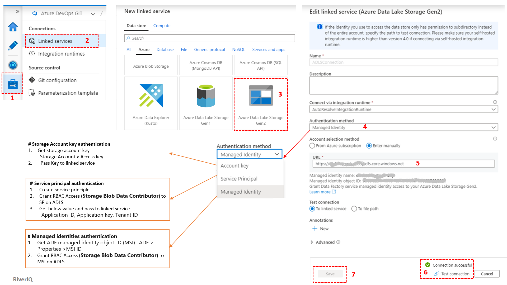
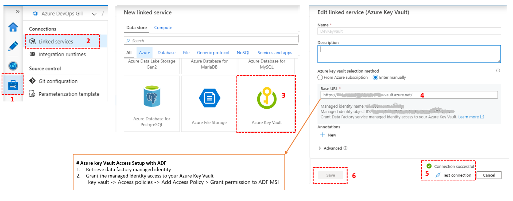
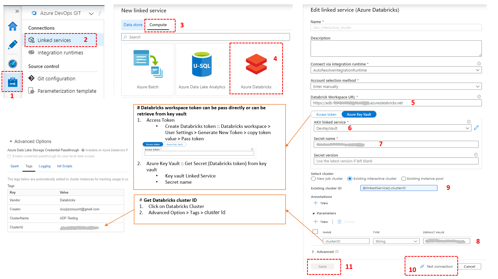
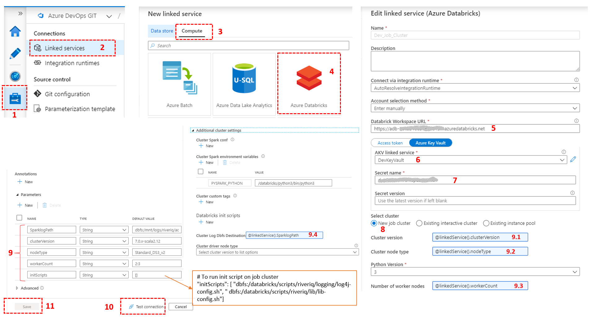
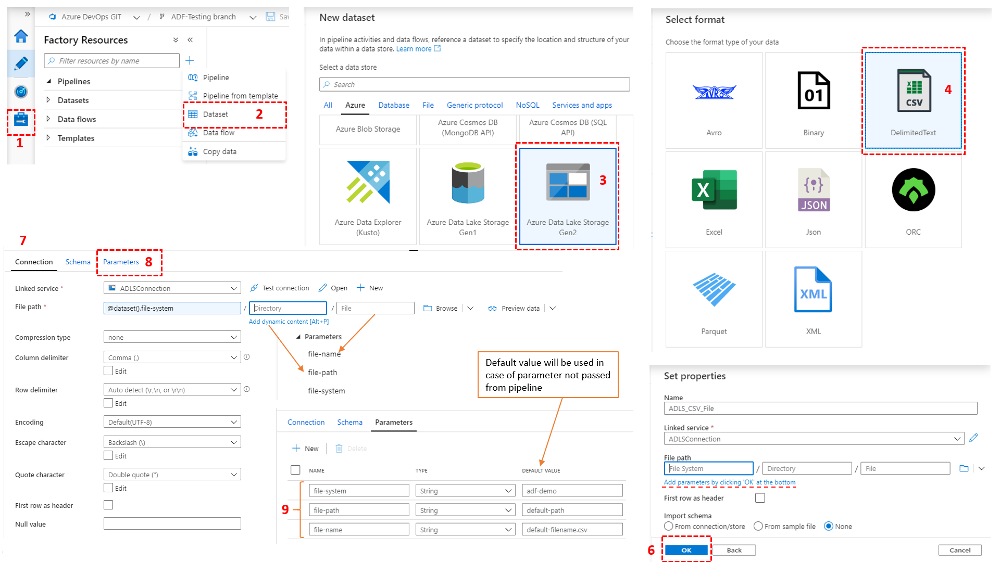
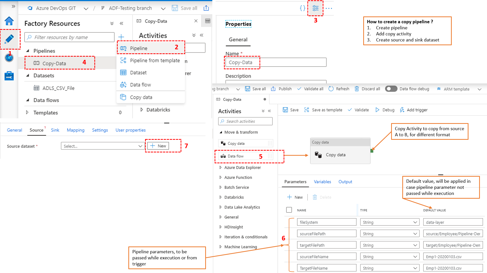
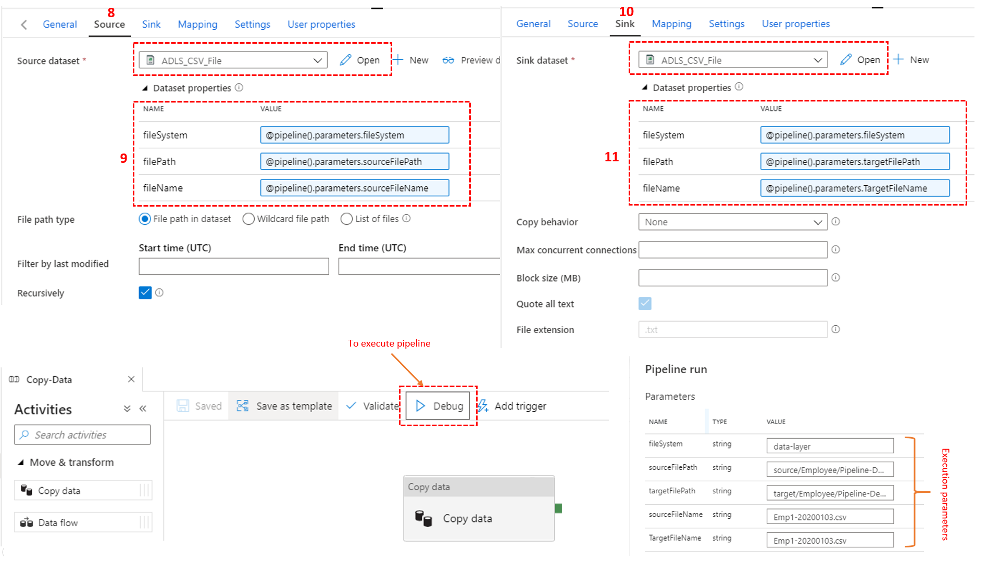
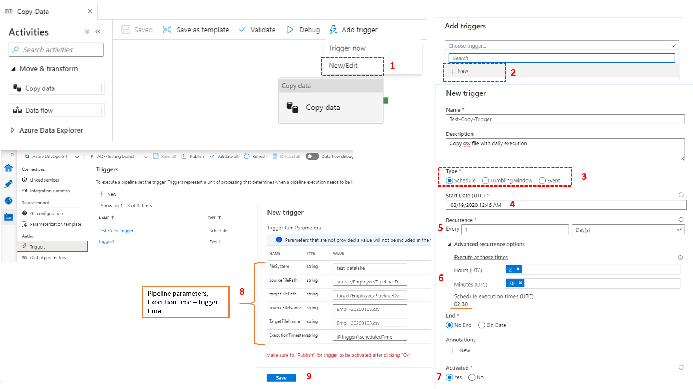

# Basic ADF Objects
## Table of Contents
* [Linked Service](#Linked-Service)
	* [Azure Data Lake Storage Gen2 Linked Service](#Azure-Data-Lake-Storage-Gen2-Linked-Service)
	* [Azure Key Vault linked service](#Azure-Key-Vault-linked-service)
	* [Databricks Interactive Cluster Linked Service](#Databricks-Interactive-Cluster-Linked-Service)
	* [Databricks Job Cluster Linked Service](#Databricks-Job-Cluster-Linked-Service)
* [Dataset](#Dataset)
	* [Azure Data Lake Storage Gen2 CSV Dataset](#Azure-Data-Lake-Storage-Gen2-CSV-Dataset)
* [Pipeline](#Pipeline)
	* [Copy Pipeline (ADLS to ADLS)](#Copy-Pipeline-(ADLS-to-ADLS))
* [Trigger](#Trigger)
	* [Copy Pipeline Trigger](#Copy-Pipeline-Trigger)

## Linked Service
### [Azure Data Lake Storage Gen2 Linked Service](linkedService/ADLSConnection.json) 

### [Azure Key Vault linked service](linkedService/DevKeyVault.json)

### [Databricks Interactive Cluster Linked Service](linkedService/Dev_Interactive_cluster.json)

### Databricks Job Cluster Linked Service

## Dataset
### [Azure Data Lake Storage Gen2 CSV Dataset](dataset/ADLS_CSV_File.json) 

## Pipeline
### [Copy Pipeline (ADLS to ADLS)](pipeline/Copy-Data.json) 

## Trigger
### [Copy Pipeline Trigger](trigger/Test-Copy-Trigger.json)

