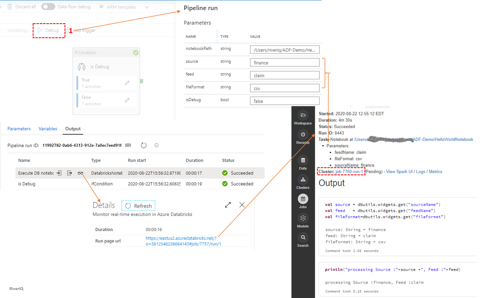
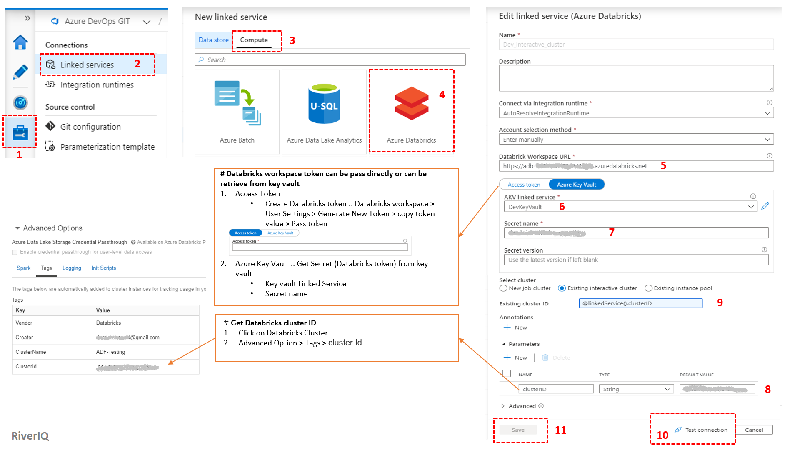
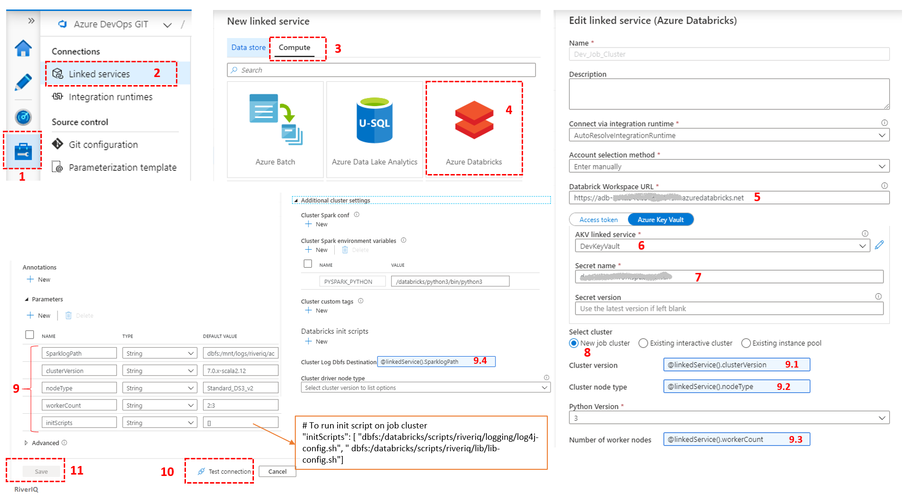

# Execute Databricks Notebook (Job/Interactive cluster)
In this tutorial, we are executing a databricks notebook from Azure data factory pipeline. We have given example for both type of cluster(Interactive / Job). We have added some parameter that will be passed to notebook for execution. In case of job cluster, linked service has some parameter for "clusterVersion","nodeType","workerCount","SparkLogPath","initScript".

### [Pipeline](pipeline/databricks-notebook-exec-example.json) 

### Pipeline Execution Result

### [Interactive cluster Linked Service](linkedService/Dev_Interactive_cluster.json)

### [Job cluster Linked Service](linkedService/Dev_Job_Cluster.json)

### [Key Vault Linked Service](linkedService/DevKeyVault.json)

