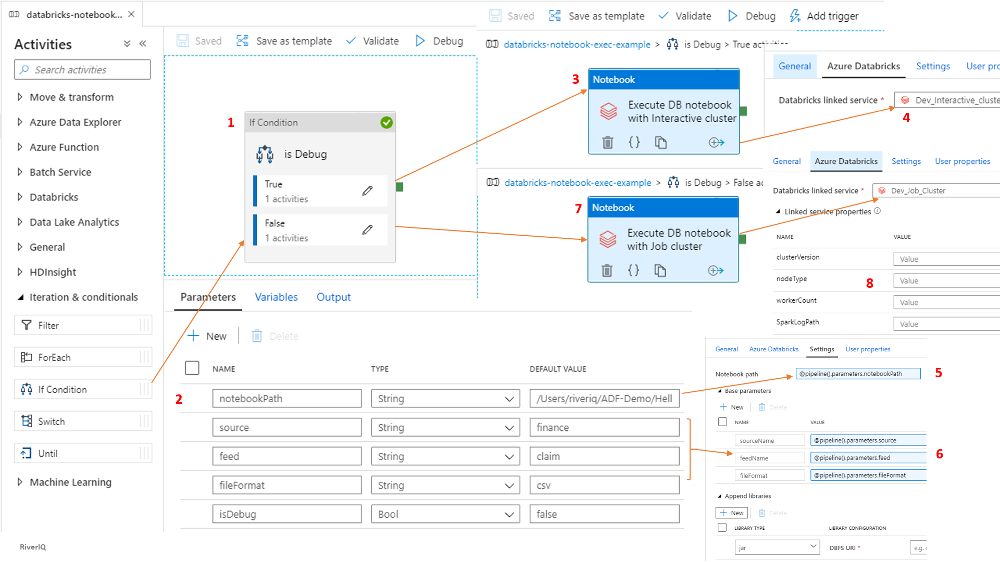

# Execute Databricks Notebook (Job/Intractive cluster)
### [Pipeline](pipeline/databricks-notebook-exec-example.json) 

### [Interactive cluster Linked Service](linkedService/Dev_Interactive_cluster.json)
### [Job cluster Linked Service](linkedService/Dev_Job_Cluster.json)
### [Key Vault Linked Service](linkedService/DevKeyVault.json)

